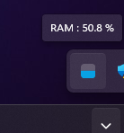

## Spyral RAM Usage

It's a little python programme to show the RAM usage in Windows Taskbar

###  Installation

1. Download the zip
2. Unzip it and place the folder your software folder (Recomanded : `C:\Program Files`) or where you want
3. To set the programme opening at PC Startup lauche the file : `Set Open at Startup.bat`

### Customisation

To customize the viewer Right-Click on it and select `Settings`. It will open the file with the settings.
If your corrupt the file, you can find the template file `settings original.txt` in program folder.
